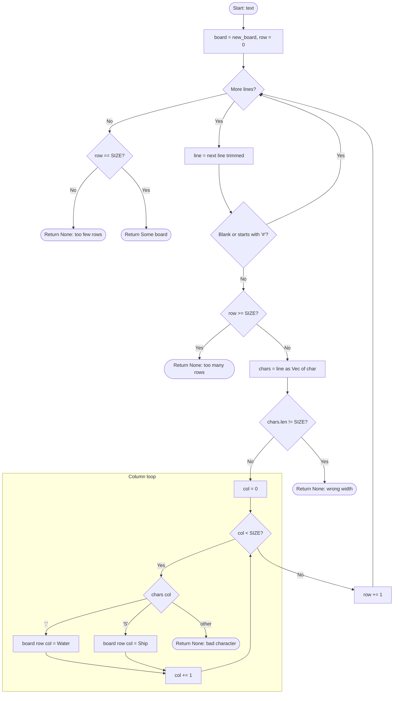

# Flowchart: `parse_board`

A loop over the rows of the file, with a loop over the columns inside it.

```mermaid
flowchart TD
    A([Start: text]) --> B[board = new_board, row = 0]
    B --> L{More lines?}
    L -- No --> R{row == SIZE?}
    R -- No --> N1([Return None: too few rows])
    R -- Yes --> S([Return Some board])
    L -- Yes --> T[line = next line trimmed]
    T --> I{Blank or starts with '#'?}
    I -- Yes --> L
    I -- No --> M{row >= SIZE?}
    M -- Yes --> N2([Return None: too many rows])
    M -- No --> C[chars = line as Vec of char]
    C --> W{chars.len != SIZE?}
    W -- Yes --> N3([Return None: wrong width])
    W -- No --> K[col = 0]
    subgraph Column loop
        K --> KC{col < SIZE?}
        KC -- Yes --> CH{chars col}
        CH -- "'.'" --> WA[board row col = Water]
        CH -- "'S'" --> SH[board row col = Ship]
        CH -- other --> N4([Return None: bad character])
        WA --> NX[col += 1]
        SH --> NX
        NX --> KC
    end
    KC -- No --> RI[row += 1]
    RI --> L
```
