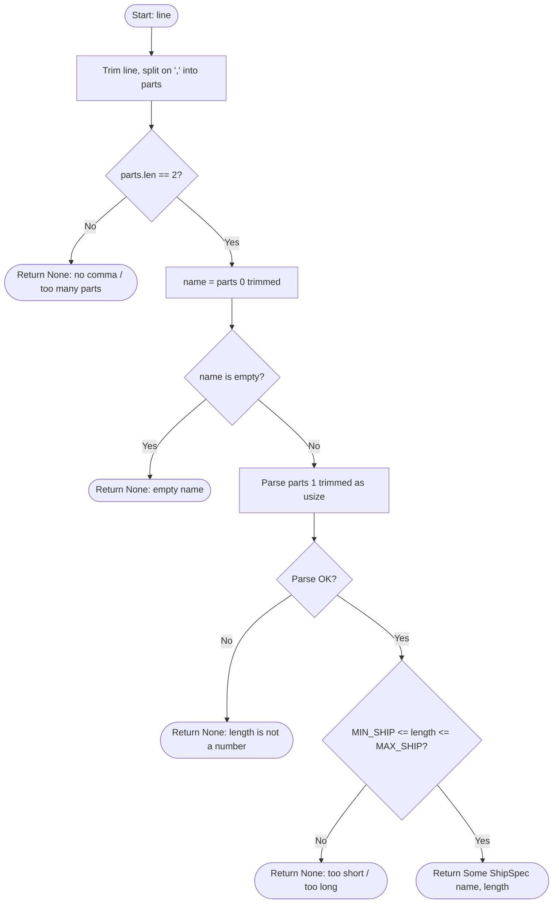

# Flowchart: `parse_ship_line`

Every path that returns `None` is shown.

```mermaid
flowchart TD
    A([Start: line]) --> B[Trim line, split on ',' into parts]
    B --> C{parts.len == 2?}
    C -- No --> N1([Return None: no comma / too many parts])
    C -- Yes --> D[name = parts 0 trimmed]
    D --> E{name is empty?}
    E -- Yes --> N2([Return None: empty name])
    E -- No --> F[Parse parts 1 trimmed as usize]
    F --> G{Parse OK?}
    G -- No --> N3([Return None: length is not a number])
    G -- Yes --> H{MIN_SHIP <= length <= MAX_SHIP?}
    H -- No --> N4([Return None: too short / too long])
    H -- Yes --> S([Return Some ShipSpec name, length])
```
